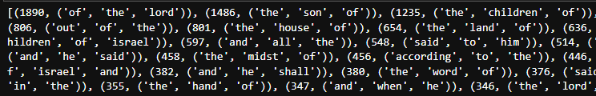

# Trigram analysis of the Douay-Rheims Bible
## Introduction
   This is a trigram analysis of the Douay-Rheims Bible. In this analysis we utilized Python, [NLTK](https://www.nltk.org/book/ch00.html), and [BeautifulSoup](https://www.crummy.com/software/BeautifulSoup/bs4/doc/) in Jupyter Labs to scrape [The Douay-Rheims from Gutenberg](https://www.gutenberg.org/files/8300/8300-h/8300-h.htm) and count the trigrams present in the verses. This analysis was sparked by one question, primarily, but has other potential utilizations. There was a simple curiosity on the researchers' end to know how often the phrase 'be not afraid'occurs in the Bible. We were able to satiate this curiosity with a simple ctrl-f search of the html. We were inspired by this question, however, to further probe the work.

<p align="center">
  
  <div class="caption" align="center">Problem solved! (kidding) </div>
</p>

   What other trigrams might we find? What might they inform us about the contents of the work? And beyond this--we're still living in a predominantly Christian world, and the Bible is still the best-selling book of all time, so there is a strong use-case for businesses to model their messaging and core tenets around common themes in the Bible.

   One major problem the researchers had was cleaning the data such that one only has content from the actual verses themselves. It's easy to segment the work such that one gets the entire contents of the Bible, i.e., the verses *and* the book titles *and* the notes about the books' contents *and* the footnotes. It is not as straightforward to capture *only* the verses. This was a unique and interesting problem that after a few iterations the researchers can proudly say they resolved! Though there is still room for improvement.

## Data Acquisition and Analysis

   Click [here](https://github.com/ThomasGDore/Bible_Trigram_Analysis/blob/main/p_model_DR.pdf) to see the full commented code, with outputs, as a .pdf.

   All the core building blocks of this work took place within the python framework on Jupyter Labs. We scraped the webpage using 'request' from the [urllib package](https://docs.python.org/3/library/urllib.html) and then parsed the output utilizing [BeautifulSoup](https://www.crummy.com/software/BeautifulSoup/bs4/doc/). This allowed us to have each \<p>\</p> be a unique object in our list. Whereas previous iterations of this project created lists of objects from the Bible where each 'new line' was a 'unique object' in the list. This however was a problematic approach as it was hard to remove footnotes without removing second lines in a verse with a short set of abstract rules. This html 'paragraph' analysis, however, allowed for each *verse* to be captured in a unique object. Thusly we had the good fortune of taking advantage of the Bible's own system of demarcation, i.e., chapter:verse (both numerical values) to select only the objects that are complete verses for the list, and to remove all other text from the final analysis.

   To accomplish this, we made a list of every number from 0 to 100 and converted each object 'type' from 'int' to 'str', or, from integer to string. Then we created a new list, taking objects from the list described above if and only if they began with a number. Therefore we are only selecting verses, and therefore avoiding the footnotes etc..
  
```
  for verse in p_list[228:-57]: 
    if verse[0] in num_list: 
        dr_p_cln.append(verse)
        
print(dr_p_cln[:3])
# ['1:1. In the beginning God created heaven, and earth.', '1:2. And the earth was void and empty, and darkness was upon the\r\n            face of the deep; and the spirit of God moved over the waters.', '1:3. And God said: Be light made. And light was made.']
```

   After this, the hard-part of the evaluation is mostly done. We do some more 'cleaning' of the verses by removing punctuation, and new-line markers ('\n') that were still present from the original html formatting. We also remove all of the chapter and verse demarcations we earlier utilized. 

   The list we are working with now is composed exclusively of verses that have been 'cleaned' of all punctuation. Each 'object' in the list is still an entire verse, and it is not yet a list of 'word-objects'. We have to make it into a list of word-objects in order to perform the trigram analysis. So we tokenize the sentences using the nltk toolkit, which means we split each 'verse' object into a series of 'word' objects and put them into a new list. 
   
```
dr_t = []

for verse in dr_2:
    tokens_temp = word_tokenize(verse)
    for i in tokens_temp:
        dr_t.append(i)
        
print(dr_t[0:15])
# ['In', 'the', 'beginning', 'God', 'created', 'heaven', 'and', 'earth', 'And', 'the', 'earth', 'was', 'void', 'and', 'empty']
```
   
   This list is still ordered as the Bible is, and therefore is still useful for trigram analysis. We then make every word into its lowercase version, thus allowing python to understand, for example, that 'Arbitrary', and 'arbitrary' are not distinct objects but rather are the same word. This allows for a more complete count.
   
 ```
 dr_t2 = [w.lower() for w in dr_t]
 
 print(dr_t2[:5])
# ['in', 'the', 'beginning', 'god', 'created']
 ```

   We performed a Frequency Distribution on the list, treating it as a '[bag of words](https://en.wikipedia.org/wiki/Bag-of-words_model)' and found that removing the stop words lead to a more useful output in this case. As the most common words without removing stop words are ('the', 'and', 'of') and after removing stop words they are ('shall', 'Lord', 'thou'). A future analysis might make nltk's list of stopwords larger by adding older english pronomials like 'thou' and 'thy'.

   We then generated a list of trigrams, which are instances of three words in a row (e.g., ('in', 'the', 'beginning')), using nltk.trigrams, and counted how many times each unique trigram shows up in our list. We put the outputs into a dictionary that associated a trigram as the key, and the count of how many times it occurred as the value to said key (e.g., (('of', 'God', 'and'), 272)). We then organized said dictionary in a descending fashion of greatest counts to least, and found the [top 50 most common trigrams in the Douay-Rheims Bible](https://github.com/ThomasGDore/Bible_Trigram_Analysis/blob/main/top_50_wsw.PNG).

```
my_trigrams = nltk.trigrams(dr_t2)

trigram_list = []
for i in my_trigrams:
    trigram_list.append(i)
    
print(trigram_list[:5])
# [('in', 'the', 'beginning'), ('the', 'beginning', 'god'), ('beginning', 'god', 'created'), ('god', 'created', 'heaven'), ('created', 'heaven', 'and')]

a = dict(Counter(trigram_list))
b = {v:k for k,v in a.items()}
items_sorted = sorted(b.items(), reverse=True)
```

<br></br>

<p align="center">
  
  <div class="caption" align="center">Part of the 50 most commmon trigrams in the Douay-Rheims</div>
</p>

## Conclusion

   Returning to our goal concerning messaging for businesses and marketing teams, we see a focus on duties and responsibilities, e.g., ('and', 'i', 'will'), ('and', 'thou', 'shalt'). More dominantly, however, we see a thematic focus upon family relations, e.g., ('the', 'son', 'of'), ('the', 'children', 'of'), ('children', 'of', 'Israel'). We would therefore recommend that if businesses want to stick around for the long term, they should center their messaging and business models on serving the families of their customers. They should also center their business models on helping their customers to perform their duties and responsibilities toward their families and communities with dignity and perhaps a sense of resoluteness.

   The researchers were also able to confirm that our ctrl-f search before was correct.

```
a['be','not','afraid'] 
# 17
```

   We performed the same analysis with the stop words removed but found the trigrams it produced less compelling. If the reader would like to see this analysis we'd point them towards the [.pdf](https://github.com/ThomasGDore/Bible_Trigram_Analysis/blob/main/p_model_DR.pdf) for the full list of trigrams with stop words removed.


## Potential future directions 

   We noticed that there is direct potential for a small fix. As we are only looking here at the most common trigrams across a relatively large dataset we were not perturbed by the appearance of 7 bracketed ('\[ ]')comments in the text. Each occurrence was located in the Psalms, and inside the brackets was only a reference to another verse in the Bible, e.g., ('\[1 Kings 24]). As a) the content would largely have been removed when the brackets and numbers were deleted and b) they only occurred at the end of sentences (thus not really interfering with a trigramic interpretation) it is virtually irrelevant to our conclusion and our final counts. However the researchers would like to return to the project to remove the bracketed items entirely for the sake of completion. We hypothesize that RegEx would be the tool for the job.


   The researchers would also like to pursue a sentiment analysis on the Bible. Namely we are curious about the differences in emotional sentiments between the two 'halves' of the Bible: The Old Testament, and The New Testament. 
